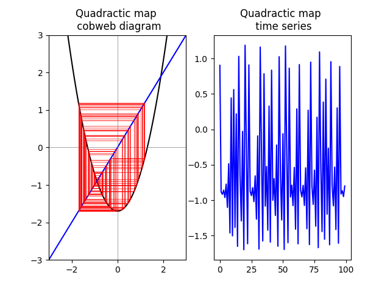
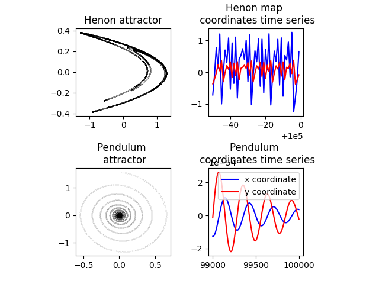
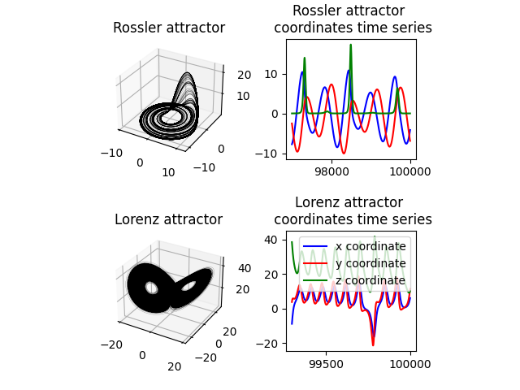
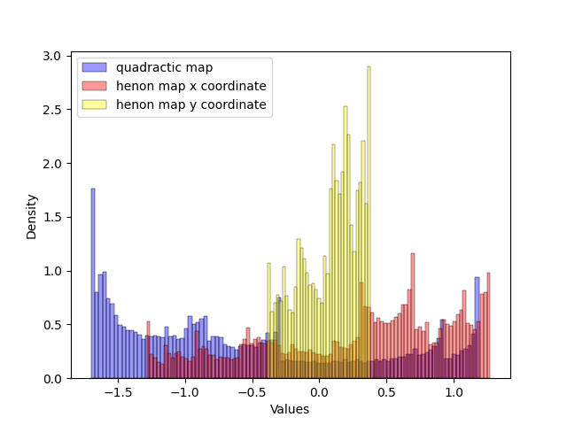
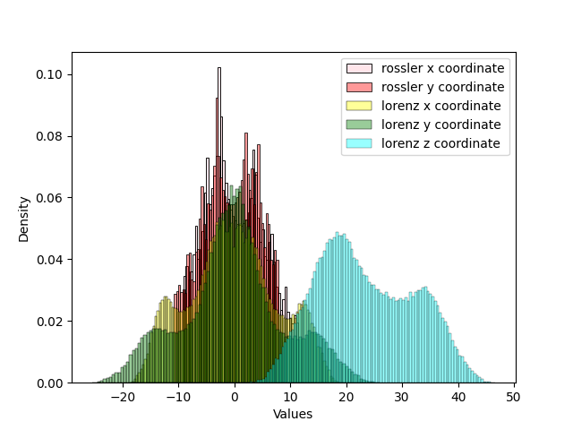
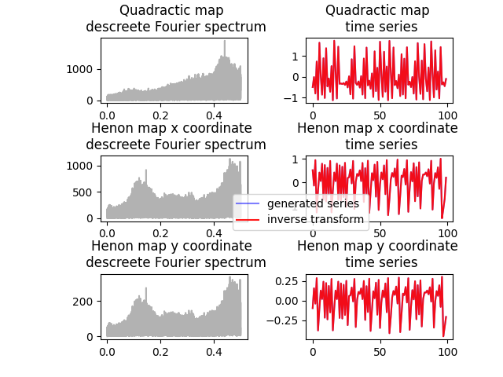
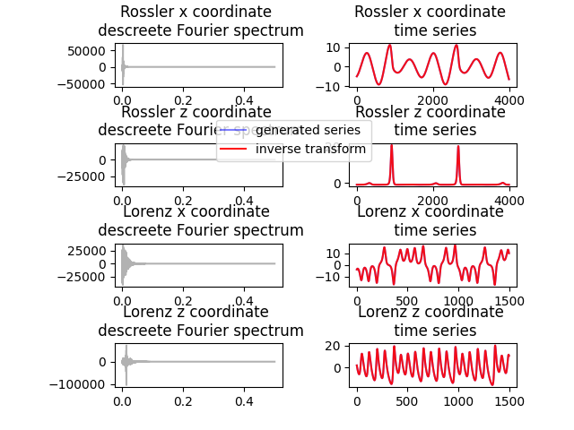
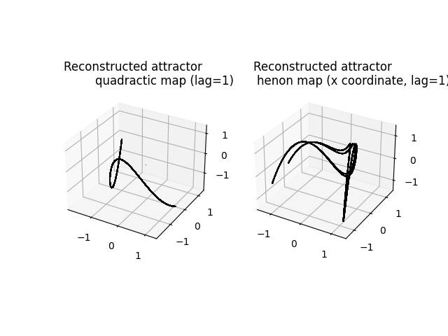
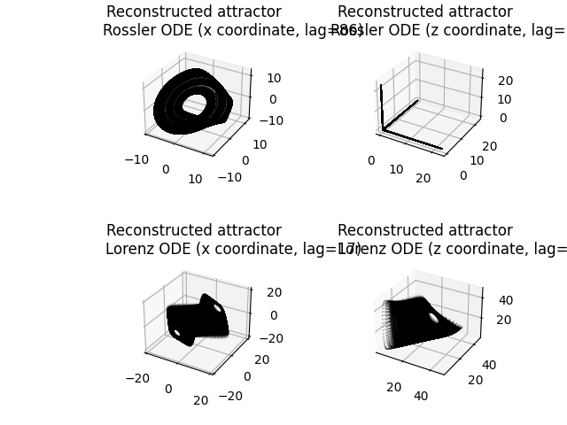
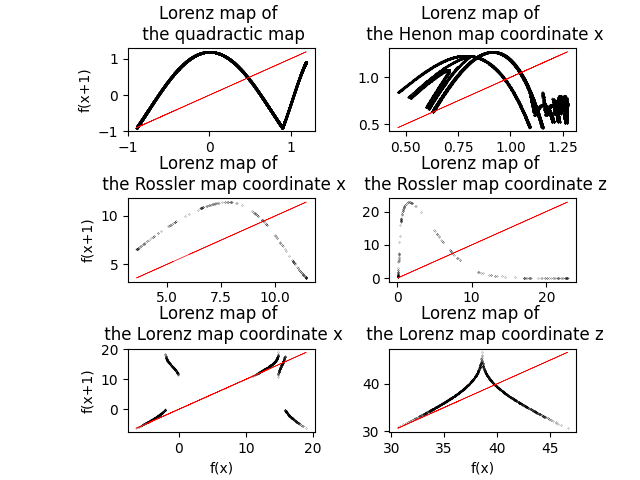

example_ODEs.py
###############

In this example I produce time series from ODEs and iterated maps already defined in the tools.py file and show how to use some features of the project to analyse this data.

First we build the data whit the function ``build_data()`` that returns two pandas dataframes, ``df_im`` containing the values of the iterated frames and ``df_ode`` containing time-series generated from the diferential equations. The two tables below are the top ten record of each table.

====  ================  =============  =============
  ..    quadractic map    henon map x    henon map y
====  ================  =============  =============
   0          0.902911      -0.211209      0.292079
   1         -0.884752       1.22963      -0.0633628
   2         -0.917215      -1.18013       0.368888
   3         -0.858717      -0.580918     -0.35404
   4         -0.962604       0.173508     -0.174275
   5         -0.773393       0.783578      0.0520523
   6         -1.10186        0.192461      0.235073
   7         -0.485897       1.18322       0.0577382
   8         -1.4639        -0.902261      0.354965
   9          0.443015       0.215259     -0.270678
====  ================  =============  =============

The table above shows iterated maps data and the table below shows data related to ODEs.

====  ============  ============  ===========  ===========  ===========  ==========  ==========  ==========
  ..    pendulum x    pendulum y    rossler x    rossler y    rossler z    lorenz x    lorenz y    lorenz z
====  ============  ============  ===========  ===========  ===========  ==========  ==========  ==========
   0     0.0356638       1.56251      4.40745     -4.03299    0.0770134    -4.79881    -3.87708     24.2244
   1     0.0512592       1.55644      4.44683     -3.99675    0.0780268    -4.71826    -4.02794     23.7724
   2     0.0667901       1.54961      4.48583     -3.96004    0.0790579    -4.66054    -4.19526     23.337
   3     0.0822489       1.54202      4.52445     -3.92288    0.0801071    -4.625      -4.37857     22.9191
   4     0.097628        1.53369      4.56268     -3.88525    0.0811746    -4.61106    -4.57763     22.52
   5     0.11292         1.52461      4.60053     -3.84716    0.0822607    -4.61814    -4.79241     22.1406
   6     0.128118        1.5148       4.63798     -3.80863    0.0833658    -4.64575    -5.02304     21.7822
   7     0.143214        1.50426      4.67503     -3.76964    0.0844901    -4.69346    -5.26978     21.4461
   8     0.158201        1.49301      4.71168     -3.73021    0.0856339    -4.76091    -5.53299     21.1336
   9     0.173071        1.48104      4.74792     -3.69033    0.0867975    -4.84779    -5.81307     20.8463
====  ============  ============  ===========  ===========  ===========  ==========  ==========  ==========

I used several method to visualize this data. For the 1D quadractic map we can visualize the orbits with the cobweb plot implemented in tools:

For 2D maps and equations it is possible to plot the attractor directelly in the phase space:

Is also possible to plot the attractors in the 3D phase space although the visualization is harder:

Much of the data seems periodic and one can wonder what are they useful for as the objective here is to study natural signals that are most likelly random at least in pieces. The signals are not periodic as we can see in the histograms of those timeseries:

These histograms shows that the values are confined in a range and are visited in a compact distribution which is not consistent with periodic functions (one can increase the beans size to see that the distribution is still consistent).

Now we can get the Fourier spectrum of theses signals:

As expected, the fit of the Fourier inverse transform fits perfectly to the data. The problem is that the signals are known to be chaotic so a prediction with the Fourier series (which is just a repetition of the signal from the beginnig) will gradually return incorrect results even being compleetely uncorrelated to the real signal eventualy. There are other ways to predict the behavior of such objects, for example, reconstructing the attractor with the method of lags which is done in the following:

Notice that the attractor of 1D and 2D maps are different from the known forms as they are embbeded now in a 3D space. The 3D ODEs are somewhat more familiar

The different forms from the exact attarctor are expected as the lag method is approximative. Different lags lead to different overall forms and the general rule to choose a lag is the minimum information lag, where the lag is such that the correlation to the original series is a local minimum. But this is not a rule, just a recomendation to identify the map.

The usefulness of identifying an attractor is that one may use specific forecasting algorithms and qualitative insight on the attractor class. For example, it is known that attractors presenting a single peak in the Lorentz map (presented in the following) then it presents a series of biffurcations, intermitency then finally chaos tuning a single parameter.

